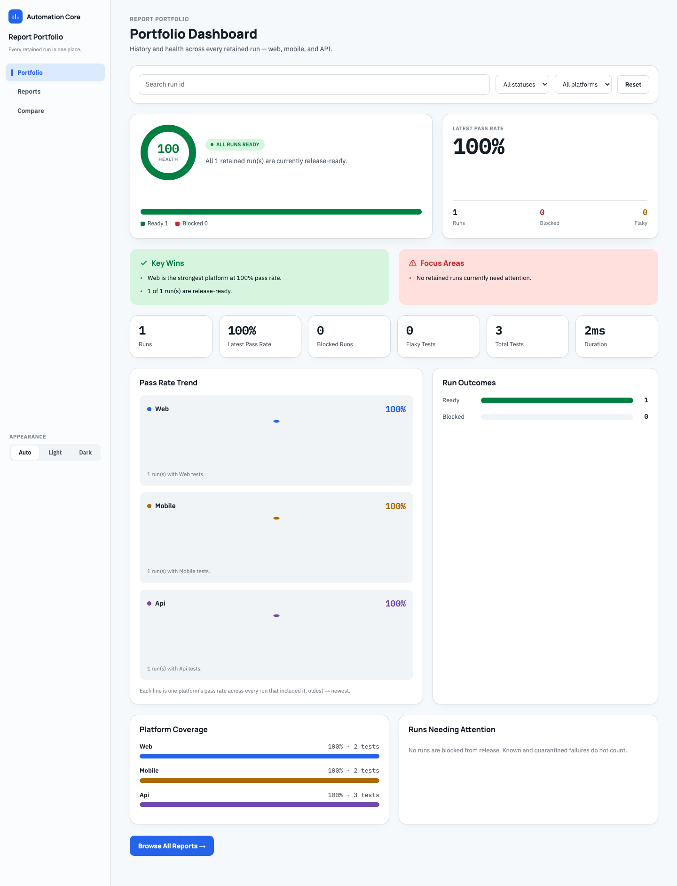
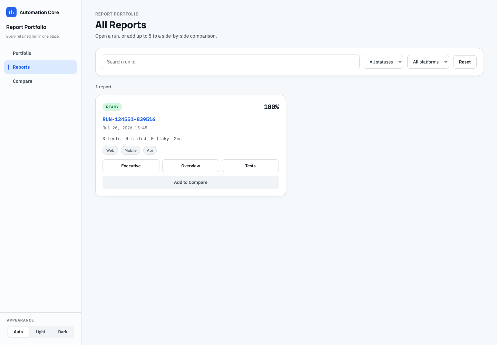
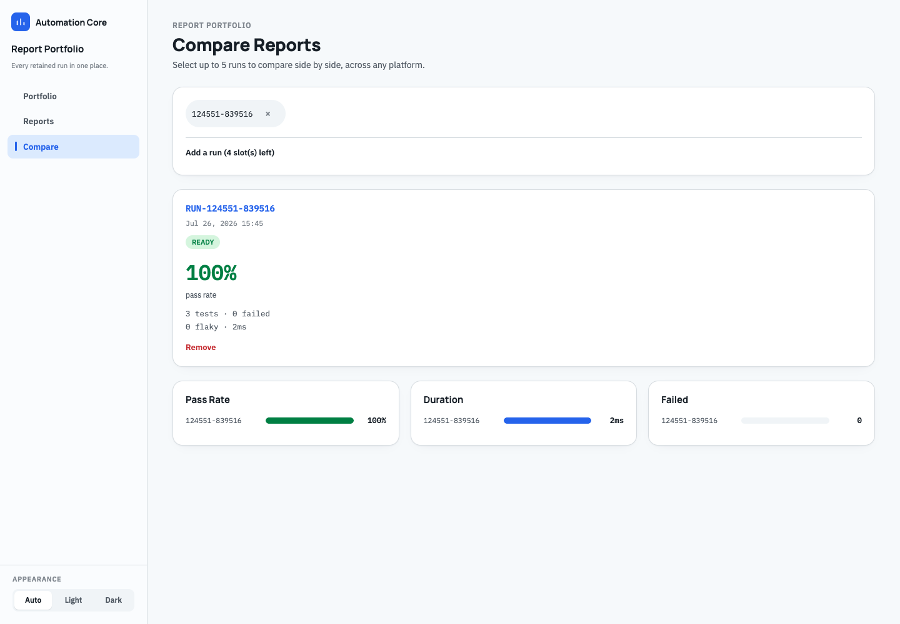
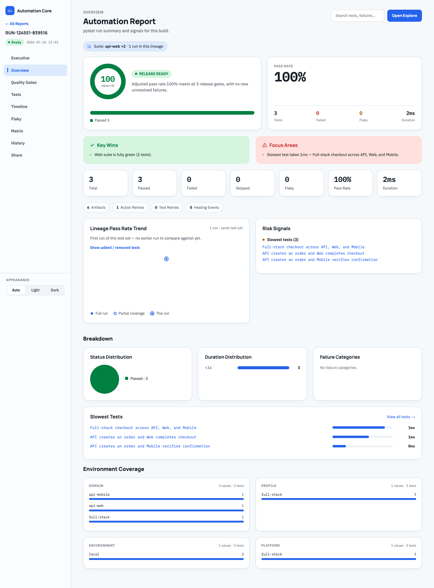
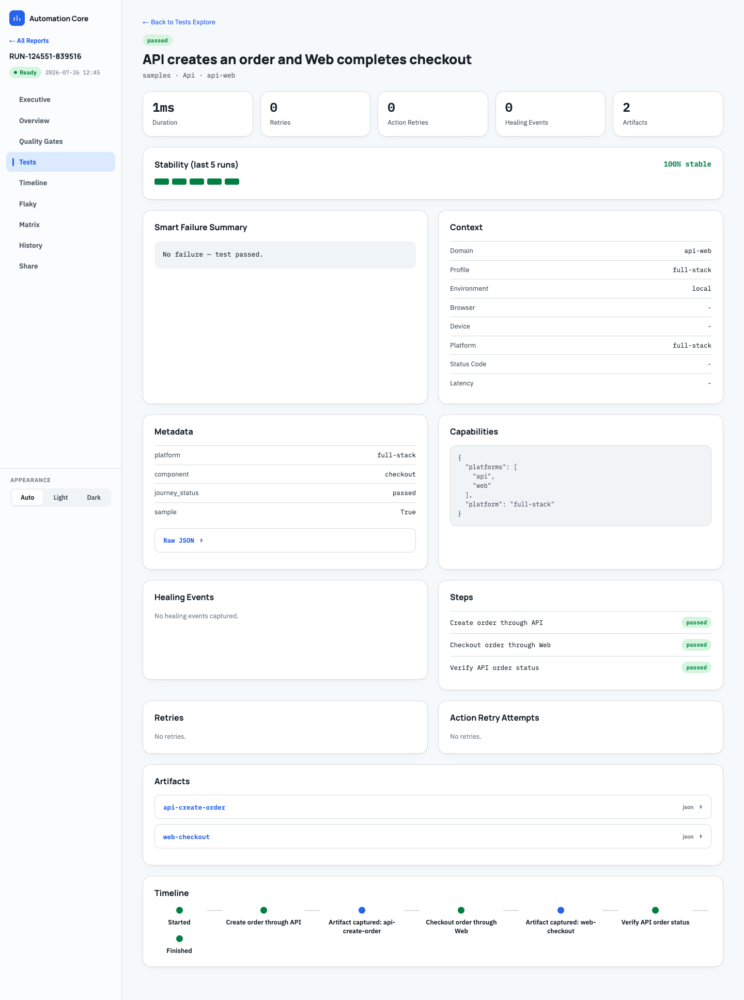

# Screenshot Index

The walkthrough screenshots are captured from a local `run-sample all` report using Playwright
bundled Chromium.

Regenerate them after report design changes:

```bash
full-stack-orchestrator run-sample all --output .tmp/docs-walkthrough-report
../web-automation-framework/.venv/bin/python docs/scripts/capture_report_screenshots.py \
  --report-root .tmp/docs-walkthrough-report
```

The capture helper intentionally uses Playwright only as a documentation QA renderer. Playwright is
not a runtime dependency of the orchestrator.

## Portfolio Dashboard



## Reports Gallery



## Compare Runs



## Run Overview



## Test Details


